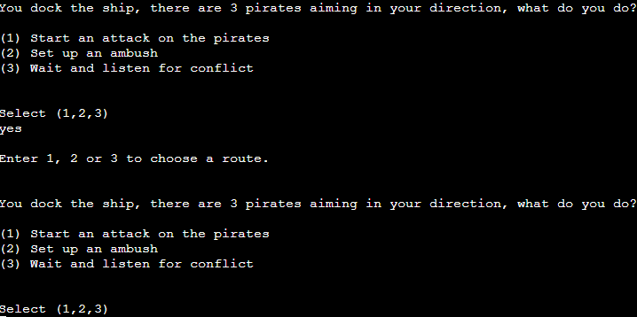

<h1 align="center">Bod's Space Adventure Game - Project Portfolio 3</h1>

## - By Joe Playdon
 
### [View the live project here](https://bod-space-adventure.herokuapp.com/) #
### [View the repository here](https://github.com/bodthegod/space-adventure-game) #

# Table of Contents:
1. [About my game](#about-my-game)
    1. [How to Play](#how-to-play)
2. [Features](#features)
    1. [Existing Features](#existing-features)
    2. [Future Features](#future-features)
    3. [Data Model](#data-model)
	4. [Wireframes](#wireframes)
3. [Languages and Resources](#languages-used)
4. [Testing](#testing)
    1. [Python Validator Results](#python-results)
    2. [Validator Testing](#validator-testing)
    3. [Manual Testing](#manual-testing)
5. [Bugs and fixes](#known-bugs)
6. [Deployment](#deployment)
    1. [Heroku](#heroku)
7. [Credits](#credits)
    

</h2>

### About my game

This is my command line interface adventure game that allows for the user to make decisions to change the storyline. 

This game is run on the Code Institute mock terminal on heroku.

## How to play

-   ### Instructions

    1. The player is given the option to read a guide on how to play the game, and given basic information about the lore in the game.
    2. To play the game, it is very simple. You as the user are given the ability to choose yes or no, and when presented missions you can select 1, 2 or 3.
    3. The player is randomly selected a weapon at the start of the game, and there are many opportunities for the player to decide what they do, which has impact on the storyline.

## Features

### Existing Features

- ### Button

    

    - This is the button that is already displayed via the Code Institute template I was given, which allows the user to play the game. 

- ### Game Prologue
       
    - This is the game prologue screen that shows text art to allow the user to have a creative image of what the game is about and some basic information about the storyline.
        

- ### Story Info
   
    - The player is shown a yes / no question asking them if they want to hear the story of the game. The user can type yes or no to progress the storyline.

- ### Name Selection
   
    - The player is told to choose a name for their character, improving interactivity and immersion within the game.

- ### Weapon Choice
   
    - The player is shown a yes / no question asking them if they would like to choose a weapon. This weapon is randomly selected out of a list of 4 options and then given to the user.

- ### First Mission
   
    - Once the player selects the weapon, the text for the first mission is displayed and lore is also displayed for the user to understand the storyline. The player is then displayed an option of three different scenarios, that advances the storyline once chosen.

- ### Second Mission Select
   
    - Once the first mission is complete, the player is given a yes or no question which advances the storyline in two different paths. 

- ### Ship Storyline Select
  
  
    - If the user selects 'Yes' to helping the galaxy, this moves them to the main storyline. This will then display a brief story to the user, and then a selection screen which advances the story yet again. This selection screen is out of 1, 2 and 3 choices. The one and two choices will advance the main storyline, and the third choice will take the user to the bounty hunt storyline (as told in the Bounty Hunt Final Mission section below).

- ### Ship Storyline Final Mission
  
    - If the user selects 1 or 2 from the section above, this will start the ship storyline final mission. The user is then presented information about the story and a choice of yes/no to defeat the final boss. If yes is selected, the user is presented with a final closing storyline and they win the game. If no is selected, the user will surrender and lose the game.

  
  - This is an overview of the win screen that is displayed to the user when the game is won.

- ### Bounty Hunt Final Mission
  
    - If the user selects 'No' to helping the galaxy, this moves them to the secondary storyline which allows them to make a final decision on the final mission of that storyline. The user is presented with a bounty hunt storyline before this, which can also be accessed when playing through the ship storyline and selecting the '(3) Press the button labelled '⎅⍜ ⋏⍜⏁ ⌿⍀⟒⌇⌇'' choice.

- ### Bounty Hunt Win Screen
  
    - If the user selects 1 in the final bounty hunt mission, this takes them to the bounty hunt win storyline. If number two and three are selected, the user loses the game and is given the option to play again.

   
    - Once the final win storyline is displayed to the user, the won_game function is called and it shows that the user has won, and gives the option to replay.

- ### Game Lost Screen
  
    - If the user gets an answer wrong, this is the message that is displayed when the user loses. There are many sections within the game that will result in this message being displayed.

    -   #### Future Features

        -   A feature that could be added are inventory functions that may change the storyline depending on the item.
        -   More paths for the user to generate and more impactful storyline changes.
        -   A nicer CLI interface or background for the user to be more immersed in the storyline.
        -   Text art that displays on missions.

## Data Model

### Functions

-   Functions are used on questions, choices and selections to prevent the code from being too repetitive and unreadable.
-   Functions allow for progression through the story by calling certain functions once specific answers are selected.

### Variables
-   Variables are used to link to classes that are within the choices.py file, to allow for simplified and easier code to write when developing the creating new questions to add to the storyline.
-   Input variables are also used to allow the user to input data into the terminal.

### Classes
-   Classes are used on the questions within the games, to allow for multiple functions that can be called from an external file. This allows for the code to be more readable, and allows for faster development time of new questions.
-   The classes i have created allow for the selection of numbers to be called, and selection of yes/no and else questions.

### Loops
-   I used a simple loop to enable the CLI to print gradually, using the time library. This for loop ensures that for each text character in the strings I have wrote, it prints each character individually, allowing for a readable result for the user as opposed to being presented the whole story at once. This is good UI design from a user standpoint and gives the player time to read the information as it is shown.

-   ### Wireframes
        
-   I have used [Balsamiq Wireframes](https://balsamiq.com/) as my desired wireframing tool for this, and I kept the game simple by simply using the Command Line Interface to play it. It is very easy to play the game as the user is instructed on how to play, what to type etc.   

### Languages Used

-   [Python](https://en.wikipedia.org/wiki/Python_(programming_language)

### Frameworks, Libraries & Programs Used

1. [Git:](https://git-scm.com/)
    - Git was used for version control by utilizing the Gitpod terminal to commit to Git and Push to GitHub, this was used throughout the development of the website
    and was essential.
1. [GitHub:](https://github.com/)
    - GitHub was used to store the projects code after being pushed from Git.
1. [Balsamiq:](https://balsamiq.com/)
    - Balsamiq was used to create the wiireframes during the design process.
1. [import time:](https://docs.python.org/3/library/time.html)
    - Import time was used for the slowprint function to work correctly, as it works based on times.
1. [import sys:](https://www.tutorialsteacher.com/python/sys-module)
    - This was used to exit the loop on the exit function (sys.exit).
1. [import random:](https://docs.python.org/3/library/random.html)
    - I used import random to pick from a list of 4 what weapon the player is given when they select yes.
## Testing

### Python Results

-   [PEP8 Validator](http://pep8online.com/)
    - Results of run.py
    
    - Results of choices.py
    
    - Results of settings.py
    

### Validator Testing

-   In order to test for faults, I used the [PEP8 Online](http://pep8online.com/) valiator to view where my code was faulty, and if there were issues. Initially, I had many intendation errors, however these were very simple to fix. I also had to add a few extra empty lines above functions that I had defined in the run.py file, but yet again these issues were very minor.

The validator helped me to clean up my code and make it very readable and easy to understand.

### Manual Testing

-   To test my code, I have checked and tested multiple different things to see if the code would function incorrectly. First, I test if the standard answers (yes/no, 1,2,3) function correctly on all options and display the correct message by entering them. When testing this, I found that there was occasionally a bug that forced a loop of the letter 'y' in the console, to prevent this I recreated the way my functions worked by using methods. 

-   As there are many different 123 and Yes/No choices throughout the game, I have provided a few screenshots to generalise the functions and how they work. Throughout the game these are all fully functional.

-   Second of all, I tested the inputs by testing the else options- these being any characted that isn't the one defined in the input. To test this, I entered random numbers and letters to test if the else messages would appear, and I coded this correctly as there were no bugs found.

-   I showed this project to a few family members, to see if they would give me any advice from a user standpoint on things to improve, and used this information to improve the game. This advice I was given included adding seperate functions for winning the losing the game, which I added after.

-   I tested the game initially without the slowprint function, however decided that as the game is a story-based adventure, the slowprint was needed to make the user experience better.

### Known Bugs

-   A bug that can take away from the player experience is a bug that allows the user to input data as the text displays, this can bug the whole game causing the required message to send multiple times.

## Deployment

### Heroku

This project was deployed using Code Institute's mock terminal for Heroku

- Steps for deployment
    - Fork or clone this repository
    - Create a new Heroku app
    
    - Set the buildpacks to Python and NodeJS in that order
    
    - Link the Heroku app to the repo
    
    - Click on Deploy

## Credits

-   For the gradual slowprint code, this was taken and inspired by [Stack Overflow](https://stackoverflow.com/questions/4099422/printing-slowly-simulate-typing) and [Codegrepper](https://www.codegrepper.com/code-examples/python/python+slow+print)
-   For information about methods, I used [Hackerearth](https://www.hackerearth.com/practice/python/object-oriented-programming/classes-and-objects-i/tutorial/)
-   Alien text comes from [Lingojam](https://lingojam.com/AlienLanguage)
-   ASCII art taken from [ASCIIart](https://www.asciiart.eu/space/spaceships) and [Patorjk](https://patorjk.com/software/taag/#p=testall&f=4Max&t=Space%20Adventure)
-   Credits to my mentor Darío for assisting me in ideas and giving inspiration.